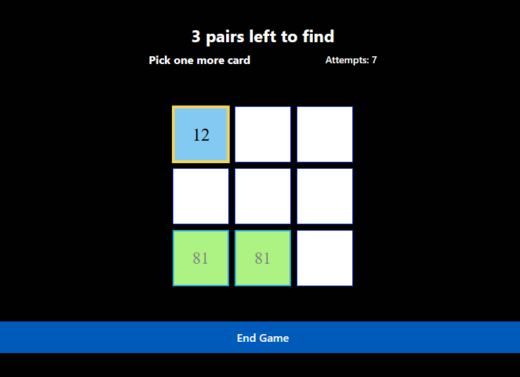

# Memory-guessing Game

A cross-platform memory matching game built with React Native and Expo. Players flip cards to find matching number pairs while avoiding a skull tile. Each completed guess, including hitting the skull, counts as an attempt. The goal is to find all pairs in the fewest attempts.

## Stack

- **Frontend:** React Native, Expo, Expo Router (file-based routing)
- **Backend:** Node.js, Express
- **Language:** TypeScript
- **Styling:** React Native StyleSheet, custom theme hooks
- **Platforms:** Web, iOS, Android
- **Tools:** ESLint

## Architecture

The project uses a **component-driven architecture** with file-based routing:

- **Expo Router** — File-based routing in `app/` directory
- **GameBoard Component** — Core game logic managing state, card flipping, pair matching, skull penalties, attempts, and evaluation feedback
- **Custom Hooks** — `useThemeColor` and `useColorScheme` for consistent theming
- **Express Server** — Serves the production web build from `/dist`
- **Constants** — Centralized color configuration for maintainability

**Game Flow:**
1. Board initializes with four shuffled number pairs and one skull tile
2. Player taps cards to reveal numbers
3. Matching pairs remain visible; mismatches flip back after a short evaluation delay
4. Hitting the skull reveals it, costs the turn, clears the current selection, and lets the player continue
5. Game tracks attempts, remaining pairs, and status feedback during evaluation
6. When all pairs are found, board input is blocked and the player can start a new game

## Run

1. Install dependencies.

```sh
npm install
```

2. Start the Expo development server.

```sh
npm start
```

Alternatively: `npm run web` (web only), `npm run ios`, or `npm run android`.

## Production Web Server

`server.js` serves the static Expo web build from `/dist`. Generate a web build before using it:

```sh
npx expo export --platform web
node server.js
```

The Express server respects `BASE_URL` or the Expo `experiments.baseUrl` value in `app.json`.

## Image


